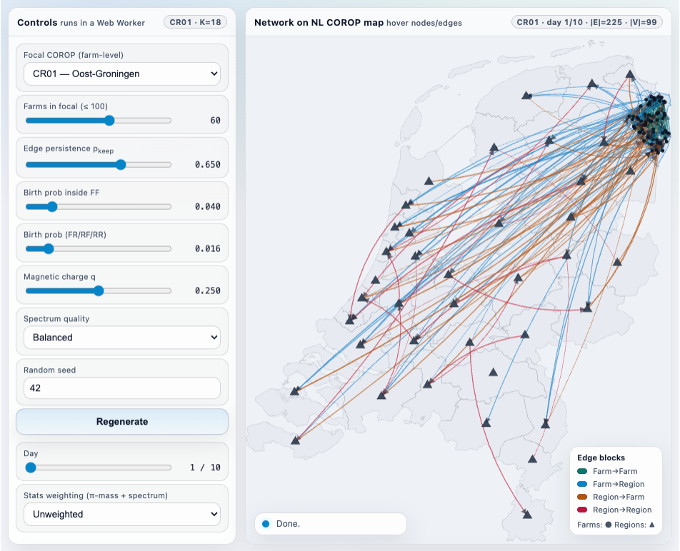
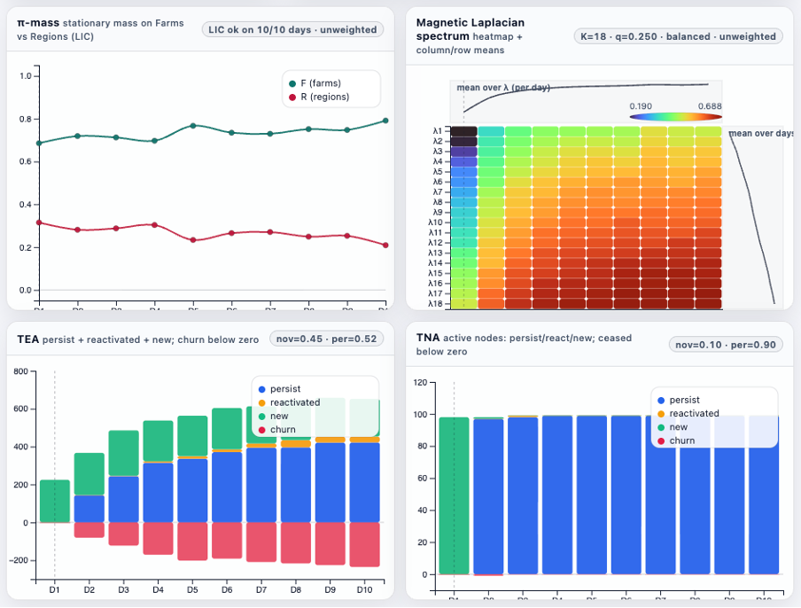

# NetSpectra

**Higher‑order statistics for hybrid (farm + region) dynamic movement networks.**  
A compact simulator and analysis scaffold for *temporal edge/node appearance*, *random‑walk mass*, and *directed spectral signatures* (magnetic Laplacian).

[](#)
[](https://github.com/EvoLandEco/netspectra)
[](https://github.com/EvoLandEco/netspectra)

---

## What is NetSpectra?

NetSpectra proposes a **hybrid dynamic graph representation** for livestock movement networks:

- Keep **farm-level** detail inside one *focal* region (e.g., a COROP region in NL),
- Contract everything outside into **regional supernodes** and **superflows**,
- Analyze day-by-day dynamics with **higher‑order statistics** that go beyond static degree counts.

This lets you preserve local detail where you care most, while still retaining a coherent national “context backbone”.

For formal definitions and interpretation guides, see:  
**https://qtj.me/blog-hybrid-corop-farm.html**

Network simulator             |  Higher-order statistics
:-------------------------:|:-------------------------:
  |  

---

## What’s included

- An interactive D3 simulator that generates a 10‑day hybrid network on the NL COROP map and visualizes:
  - **TEA / TNA**: temporal edge / node appearance (new / reactivated / persistent / churn)
  - **π‑mass**: stationary random-walk mass on Farms vs Regions (LIC-restricted)
  - **Magnetic Laplacian spectra**: directed spectral signatures (with quality + weighting toggles)
- COROP boundaries + label points (`nl_corop.geojson`, `nl_corop_labelpoint.geojson`)

> If you fork this for a different country: replace the two GeoJSONs and the simulator will still run.

---

## Quickstart

### 1) Clone
```bash
git clone https://github.com/EvoLandEco/netspectra.git
cd netspectra
```

### 2) Serve the simulator folder
Browsers block `fetch()` from `file://`, so run a tiny local server:

```bash
python -m http.server 8000
```

### 3) Open in browser
```text
http://localhost:8000/simulator/hybrid_simulator_V10.html
```

Make sure these files sit next to the simulator HTML (or update the paths inside the HTML):
- `nl_corop.geojson`
- `nl_corop_labelpoint.geojson`

---

## How to use

1. **Pick a focal region** and **farm count** (≤ 100).
2. Tune network dynamics:
   - **p_keep** controls persistence of yesterday’s edges,
   - **birth probs** control the chance of new edges appearing.
3. Use the **Day** slider to step through time.
4. Use the **Unweighted / Weighted** switch to decide whether:
   - π‑mass and magnetic spectra treat each edge equally (**unweighted**), or
   - they incorporate simulated trade volume (**weighted**).
5. Use **Spectrum quality** to trade speed for fidelity (Fast / Balanced / Full).

The status badge in the map panel shows progress; hover it to reveal **Cancel** while heavy computations run.

---

## Embedding in a blog

The simulator supports:
- automatic height resizing using **iframe-resizer**, and
- dark-mode sync with a site-level `#darkmode` checkbox (if present).

See the embedding snippet and explanation in:  
**https://qtj.me/blog-hybrid-corop-farm.html**

---

## Acknowledgements

NetSpectra’s simulator uses:
- **D3.js** for visualization,
- **Turf.js** for point-in-polygon sampling,
- **numeric.js** for eigen-decomposition in the Web Worker,
- **iframe-resizer** for clean iframe embedding.

---

## License

MIT License.
